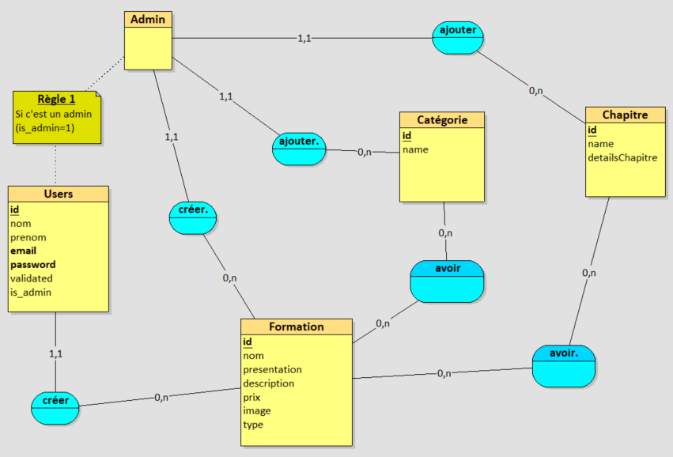

<a href="#" target="_blank">EducateYoursef</a>

## Documentation pour faciliter l'utilisation de l'application

EducateYoursef est une plateforme web, le processus de formation en ligne.

Tout le monde peut l'utiliser, des visiteurs non connecté, des formateurs qui vont créé des formations, un administrateur qui gére tout.
## MCD : 
- Un Admin peut  
    - Ajouter/modifier/supprimer des formations/catégories/chapitres  
    - Valider les comptes des visiteurs pour qu'il deviennent des formateurs  
    - Gérer son compte  

- Un Formateur peut gérer ses formations (Ajouter / Modifier / Supprimer) et gérer son compte  
- Un visiteur peut visionner toutes les formations et naviguer entre ses chapitres  

## Installation :
(Tous ce qui est en **gras** il faut le mettre dans la console)
- Récupération du projet :  
  **git clone https://github.com/tahathedancer98/EducateYourself.git**  
- Accedez au répértoire du projet :  
  **cd EducateYourself**  
- Basculez bien sur la branche master :  
  **git checkout master**  
- Installation du composer :  
  **composer update**  
- Copiez le fichier **.env.example** et collez le, changez son nom en mettant **.env** et mettez les valeurs suivantes en fonction de vos paramètres de base de données :  
  **DB_CONNECTION=mysql  
  DB_HOST=127.0.0.1  
  DB_PORT=3306  
  DB_DATABASE=[Le nom de votre base de données]  
  DB_USERNAME=[votre username]  
  DB_PASSWORD=[votre mot de passe]**   
- Rajouter la partie mail dans **.env** :  
  **MAIL_MAILER=smtp  
  MAIL_HOST=smtp.mailtrap.io  
  MAIL_PORT=2525  
  MAIL_USERNAME=[votre username]  
  MAIL_PASSWORD=[votre password]  
  MAIL_ENCRYPTION=tls  
  MAIL_FROM_ADDRESS=null  
  MAIL_FROM_NAME="${APP_NAME}"**   
- Migration (Création des tables + remplir les données):  
  **php artisan migrate:fresh --seed**  
    
## Lancement de l'application
- **php artisan serve** 
## Les comptes de test
- **Administrateur** 
    - Email : admin@admin.com  
    - Mot de passe : admin   
- **Formateur 1**  
    - Email : user@user.com  
    - Mot de passe : password

## Les fonctionnalités :
- **Admin** : 
    - Créer, modifier, supprimer des formations, catégories, chapitres.
    - Modifier son profil.

- **Formateur** :
    - Créer, modifier, supprimer une formation.
    - Modifier son profil.
- **Visiteur** :
    - Visualiser les formations, et suivre une formation en naviguant dans ses chapitres.

## Des précisions :
- Au moment du lancement de l'application pour la premiere fois, il faut juste modifier les images des 3 formations de bases.
- Le reste marche bien.
